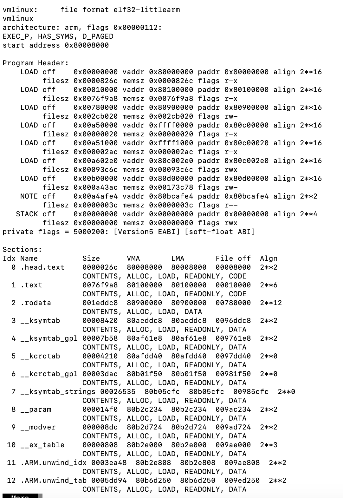
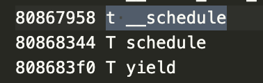
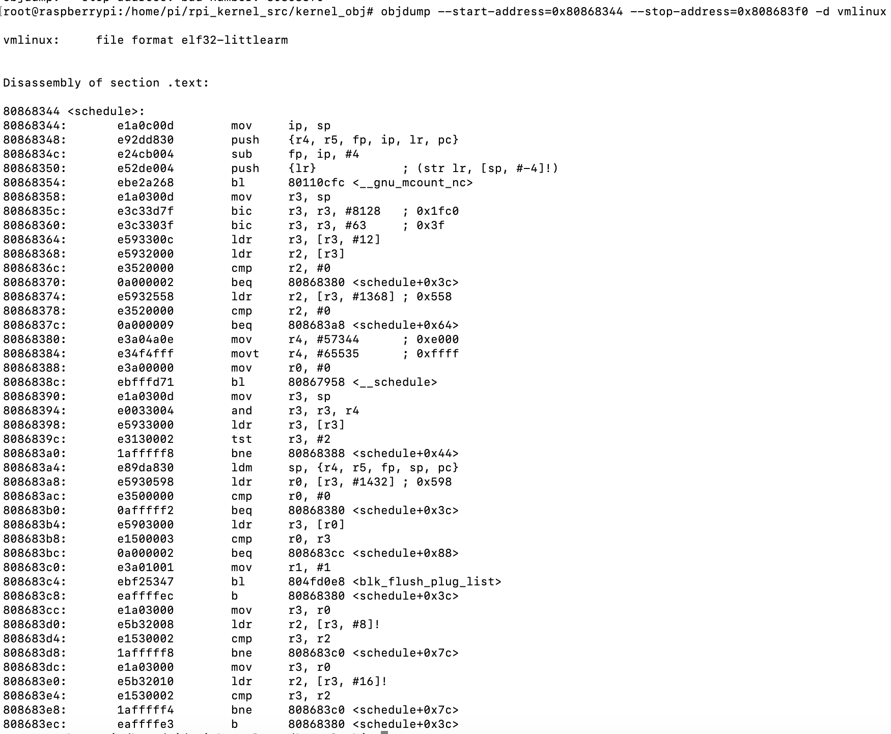

# objdump 바이너리 유틸리티
바이너리 유틸리티는 오브젝트 포맷의 파일을 조작할 수 있는 프로그램

- objdump: 라이브러리나 ELF형씩의 파일을 어셈블리어로 출력
- as: 어셈블러
- ld: 링커
- addr2line: 주소를 파일과 라인으로 출력
- nm: 오브젝트 파일의 심벌을 출력
- readelf: ELF 파일의 내용을 출력


## 헤더 정보 확인
```
$ objdump -x vmlinux | more
```


스타트업 코드의 주소는 0x80008000
(스타트업 코드는 이미지가 처음 실행될 때 동작, 어셈블리 코드로 구성되어져 있으며 보통 시스템 초기 설정을 수행하고 모드별 스택 주소를 설정함)

## 어셈블리어 확인
```
$ objdump -d vmlinux
```

옵션을 지정하여 특정 함수 어셈블리 코드를 보는것이 가능
System.map 파일을 참고

ex] schedule() 함수의 주소 범위 확인


80868344 ~ 808683f0
```
$ objdump --start-address=[시작주소] --stop-address=[끝 주소] -d vmlinux
```


